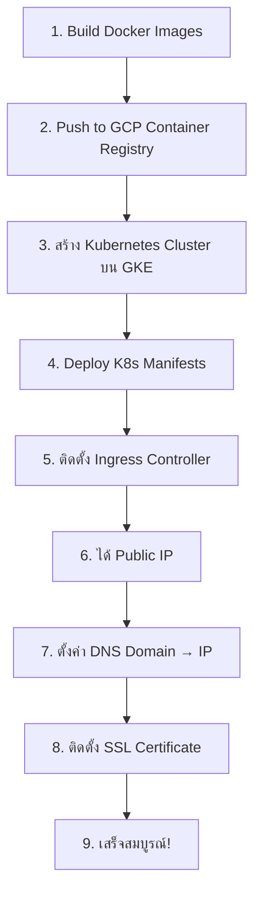

# 🎯 คู่มือ Deploy แบบละเอียด - จาก Localhost ไป GCP

## 📚 Table of Contents
1. [ตอบคำถามพื้นฐาน](#คำตอบคำถามที่คุณถาม)
2. [สถานะโปรเจคตอนนี้](#สถานะโปรเจคของคุณ)
3. [ขั้นตอน Deploy ทีละขั้น](#ขั้นตอน-deploy)
4. [เรื่อง IPv4 และ Domain](#เรื่อง-ipv4)
5. [รอระบบจากอาจารย์](#รอจากอาจารย์)

---

## ❓ คำตอบคำถามที่คุณถาม

### 1. **IPv4 จะได้จากไหน?**

```
คำตอบ: ได้จาก Google Cloud Platform (GCP) ❌ ไม่ใช่จาก Router บ้านคุณ

เมื่อคุณ Deploy บน GCP:
┌─────────────────────────────────────────────────┐
│  GCP ให้ Public IPv4 Address                     │
│  ตัวอย่าง 34.87.123.45                            │
│                                                 │
│  ┌──────────────────┐                           │
│  │ Load Balancer    │ ← IP นี้จะได้จาก GCP         │
│  │ 34.87.123.45     │                           │
│  └────────┬─────────┘                           │
│           │                                     │
│           ▼                                     │
│  ┌──────────────────┐                           │
│  │ Traefik Ingress  │                           │
│  └────────┬─────────┘                           │
│           │                                     │
│     ┌─────┴─────┬──────────┐                    │
│     ▼           ▼          ▼                    │
│  Frontend   Backend   Monitoring                │
└─────────────────────────────────────────────────┘
```

**สรุป:**
- ✅ **บน GCP**: ได้ Public IPv4 จาก Google (เช่น 34.87.123.45)
- ❌ **Router บ้าน**: ใช้ไม่ได้เพราะเป็น Private IP (192.168.x.x)
- 🌐 **Domain**: `beliv.muict.app` จะชี้ไปที่ IP ที่ได้จาก GCP

---

### 2. **หลักการ Deploy คืออะไร?**



**อธิบายแต่ละขั้นตอน:**

#### **Step 1-2: Build & Push Images**
```powershell
# Build ใน local
cd frontend
docker build -t frontend:latest .

cd ../backend
docker build -t backend:latest .

# Push ไป GCP Container Registry
docker tag frontend:latest gcr.io/YOUR_PROJECT_ID/frontend:latest
docker push gcr.io/YOUR_PROJECT_ID/frontend:latest
```

#### **Step 3: สร้าง Kubernetes Cluster บน GKE**
```bash
gcloud container clusters create beliv-cluster \
  --zone asia-southeast1-a \
  --num-nodes 3 \
  --machine-type e2-medium
```
- GKE = Google Kubernetes Engine (Kubernetes ที่ Google จัดการให้)
- จะได้ Cluster 3 เครื่อง (nodes)

#### **Step 4: Deploy Kubernetes**
```bash
kubectl apply -f k8s/namespace.yaml
kubectl apply -f k8s/database/
kubectl apply -f k8s/backend/
kubectl apply -f k8s/frontend/
kubectl apply -f k8s/ingress/
```

#### **Step 5: Ingress Controller**
```bash
# ติดตั้ง Traefik
helm install traefik traefik/traefik --set service.type=LoadBalancer
```

#### **Step 6: ได้ Public IP** ⭐ **ขั้นตอนสำคัญ!**
```bash
kubectl get svc -n kube-system traefik
# OUTPUT:
# NAME      TYPE           EXTERNAL-IP      PORT(S)
# traefik   LoadBalancer   34.87.123.45     80:30080/TCP, 443:30443/TCP
```
✅ **ได้ IP: 34.87.123.45** ← นี่คือ IPv4 ที่จะใช้!

#### **Step 7: ตั้งค่า DNS**
```
ไปที่ DNS Management (CloudFlare/Google DNS)
เพิ่ม A Record:
┌──────────────────┬──────────────────┐
│ Name             │ Value            │
├──────────────────┼──────────────────┤
│ beliv.muict.app  │ 34.87.123.45     │
└──────────────────┴──────────────────┘
```

#### **Step 8: SSL Certificate**
```bash
# ติดตั้ง cert-manager เพื่อได้ HTTPS
kubectl apply -f https://github.com/cert-manager/cert-manager/releases/download/v1.13.0/cert-manager.yaml
```

---

### 3. **Domain Name: beliv.muict.app**

```
beliv.muict.app คือ Subdomain ที่อาจารย์จะให้

โครงสร้าง:
┌─────────────────────────────────┐
│ beliv.muict.app                 │  ← คุณจะได้นี้
│   │    │     └── .app (TLD)     │
│   │    └── muict (Domain)       │
│   └── beliv (Subdomain ของคุณ)  │
└─────────────────────────────────┘

การทำงาน:
User พิมพ์ https://beliv.muict.app
       ↓
DNS lookup → ได้ IP: 34.87.123.45
       ↓
Browser เชื่อมต่อไปที่ 34.87.123.45
       ↓
GCP Load Balancer รับ request
       ↓
Traefik Ingress กระจายไปยัง:
  - /      → Frontend
  - /api   → Backend
```

---

## ✅ สถานะโปรเจคของคุณ

ผมตรวจสอบโปรเจคของคุณแล้ว:

### ✅ **พร้อมแล้ว:**
- [x] Kubernetes Manifests ครบถ้วน (namespace, database, backend, frontend, ingress)
- [x] Docker Compose files
- [x] Deployment scripts (deploy.ps1, deploy.sh)
- [x] Monitoring setup (Prometheus, Grafana)
- [x] Documentation (README.md)

### ⏳ **ขาดเฉพาะ:**
- [ ] GCP Account/Project setup
- [ ] Domain name จากอาจารย์
- [ ] Deploy จริงบน GCP

**สรุป: โปรเจคคุณพร้อม 95%** ✅  
รอแค่อาจารย์ให้ GCP credentials และ domain name

---

## 🚀 ขั้นตอน Deploy

### **ระยะที่ 1: ทดสอบบน Localhost (ทำได้แล้วตอนนี้)**

```powershell
# ถ้ามี Minikube/Kind
minikube start

# Deploy
cd k8s
kubectl apply -f namespace.yaml
kubectl apply -f database/
kubectl apply -f backend/
kubectl apply -f frontend/
kubectl apply -f ingress/

# ตรวจสอบ
kubectl get all -n superproject-ns

# เข้าใช้งาน (Port Forward)
kubectl port-forward -n superproject-ns svc/frontend 3000:80
# เปิด browser: http://localhost:3000
```

### **ระยะที่ 2: เตรียม Push GitHub (ทำได้ตอนนี้)**

```powershell
# ตรวจสอบ status
git status

# Add ทุกไฟล์
git add .

# Commit
git commit -m "Add K8s manifests and deployment configs for GCP deployment"

# Push
git push origin deploy/feature/monitor
```

### **ระยะที่ 3: Deploy บน GCP (รออาจารย์แจ้ง)**

#### **3.1 ติดตั้ง gcloud CLI**
```powershell
# ดาวน์โหลด: https://cloud.google.com/sdk/docs/install
# หลังติดตั้งเสร็จ
gcloud init
gcloud auth login
```

#### **3.2 Set Project**
```bash
# อาจารย์จะให้ Project ID เช่น "muict-project-2025"
gcloud config set project muict-project-2025
```

#### **3.3 Build & Push Images**
```bash
# Enable Container Registry
gcloud services enable containerregistry.googleapis.com

# Build และ Push (หรือใช้ script ที่มีอยู่แล้ว)
cd k8s
./build-images.ps1

# Tag for GCR
docker tag frontend:latest gcr.io/muict-project-2025/frontend:latest
docker tag backend:latest gcr.io/muict-project-2025/backend:latest

# Push
docker push gcr.io/muict-project-2025/frontend:latest
docker push gcr.io/muict-project-2025/backend:latest
```

#### **3.4 สร้าง GKE Cluster**
```bash
gcloud container clusters create beliv-cluster \
  --zone asia-southeast1-a \
  --num-nodes 3 \
  --machine-type e2-medium \
  --disk-size 30 \
  --enable-autorepair \
  --enable-autoupgrade
```
⏱️ **ใช้เวลาประมาณ 5-10 นาที**

#### **3.5 Connect kubectl to GKE**
```bash
gcloud container clusters get-credentials beliv-cluster \
  --zone asia-southeast1-a

# ตรวจสอบ
kubectl get nodes
# ควรเห็น 3 nodes
```

#### **3.6 Update Image Paths**
ต้องแก้ไข Deployment manifests ให้ใช้ image จาก GCR:

```yaml
# k8s/frontend/deployment.yaml
spec:
  containers:
  - name: frontend
    image: gcr.io/muict-project-2025/frontend:latest  # เปลี่ยนตรงนี้
    
# k8s/backend/deployment.yaml
spec:
  containers:
  - name: backend
    image: gcr.io/muict-project-2025/backend:latest  # เปลี่ยนตรงนี้
```

#### **3.7 Deploy Application**
```bash
# Deploy ทุกอย่าง
kubectl apply -f namespace.yaml
kubectl apply -f database/
kubectl apply -f backend/
kubectl apply -f frontend/

# ตรวจสอบ
kubectl get all -n superproject-ns
```

#### **3.8 ติดตั้ง Traefik Ingress**
```bash
# Add Helm repo
helm repo add traefik https://traefik.github.io/charts
helm repo update

# Install Traefik
helm install traefik traefik/traefik \
  --namespace kube-system \
  --set service.type=LoadBalancer
```

#### **3.9 รอ External IP** ⭐ **ขั้นตอนสำคัญ!**
```bash
kubectl get svc -n kube-system traefik

# รอจนกว่า EXTERNAL-IP จะไม่เป็น <pending>
# อาจใช้เวลา 2-3 นาที

# ตัวอย่าง output:
# NAME      TYPE           EXTERNAL-IP      PORT(S)
# traefik   LoadBalancer   34.87.123.45     80:30080/TCP, 443:30443/TCP
```

#### **3.10 Apply Ingress Rules**
```bash
kubectl apply -f ingress/ingress-traefik.yaml
```

#### **3.11 ได้ Public IP แล้ว!**
```bash
# จดบันทึก IP
export EXTERNAL_IP=$(kubectl get svc -n kube-system traefik -o jsonpath='{.status.loadBalancer.ingress[0].ip}')
echo "Your Public IP: $EXTERNAL_IP"

# ทดสอบ
curl http://$EXTERNAL_IP
# ควรได้ HTML ของ Frontend
```

---

## 🌐 เรื่อง IPv4

### **เข้าใจแนวคิด IPv4 บน GCP**

```
┌────────────────────────────────────────────────────────────┐
│                    Google Cloud Platform                   │
│                                                            │
│  ┌──────────────────────────────────────────────────────┐  │
│  │  GKE Cluster (Kubernetes)                            │  │
│  │                                                      │  │
│  │  ┌─────────────┐  ┌─────────────┐  ┌─────────────┐   │  │
│  │  │   Node 1    │  │   Node 2    │  │   Node 3    │   │  │
│  │  │ Private IP  │  │ Private IP  │  │ Private IP  │   │  │
│  │  │ 10.0.1.10   │  │ 10.0.1.11   │  │ 10.0.1.12   │   │  │
│  │  └─────────────┘  └─────────────┘  └─────────────┘   │  │
│  │         ▲                ▲                ▲          │  │
│  └─────────┼────────────────┼────────────────┼──────────┘  │
│            │                │                │             │
│            └────────────────┴────────────────┘             │
│                             │                              │
│                   ┌─────────▼──────────┐                   │
│                   │  Load Balancer     │                   │
│                   │  (Public IP)       │                   │
│                   │  34.87.123.45      │ ← จาก GCP         │
│                   └────────────────────┘                   │
└────────────────────────────┬───────────────────────────────┘
                             │
                             ▼
                      Internet (Public)
                             ▲
                             │
                    ┌────────┴────────┐
                    │  DNS Server     │
                    │  CloudFlare     │
                    └─────────────────┘
                    beliv.muict.app → 34.87.123.45
```

### **เปรียบเทียบ Localhost vs GCP**

| ส่วน | Localhost (Minikube) | GCP (GKE) |
|------|---------------------|-----------|
| **IP Address** | 127.0.0.1 (loopback) | 34.87.123.45 (public) |
| **เข้าถึงได้จาก** | เฉพาะเครื่องคุณ | ทุกคนทั่วโลก |
| **Domain** | localhost หรือ .local | beliv.muict.app |
| **Port Forward** | ต้องทำ (kubectl port-forward) | ไม่ต้อง มี LoadBalancer |
| **SSL/HTTPS** | ไม่จำเป็น | ต้องมี (cert-manager) |
| **ค่าใช้จ่าย** | ฟรี | ประมาณ $75-100/เดือน |

---

## ⏳ รอจากอาจารย์

### **ข้อมูลที่รอจากอาจารย์ (2-3 วัน):**

1. ✅ **GCP Project ID**
   - ตัวอย่าง: `muict-project-2025`
   - จะใช้ใน: `gcloud config set project`

2. ✅ **Domain Name/Subdomain**
   - ตัวอย่าง: `beliv.muict.app`
   - จะใช้ใน: Ingress configuration

3. ✅ **GCP Credentials/Access**
   - Service Account Key (JSON file)
   - หรือ IAM Role assignment

4. ✅ **DNS Access**
   - สิทธิ์แก้ไข DNS records
   - หรืออาจารย์จะตั้งค่าให้

5. ⚠️ **Budget/Quota**
   - จำกัดการใช้งาน
   - ขนาด Cluster
   - จำนวน resources

---

## 🎬 สิ่งที่คุณทำได้ตอนนี้

### ✅ **ขั้นตอนที่ 1: ทดสอบ Localhost**
```powershell
# Start Minikube (ถ้ายังไม่มีติดตั้ง: choco install minikube)
minikube start --driver=docker

# Deploy
cd "c:\Users\pipat\OneDrive\เอกสาร\GitHub\project-ffinal\k8s"
kubectl apply -f namespace.yaml
kubectl apply -f database/
kubectl apply -f backend/
kubectl apply -f frontend/
kubectl apply -f ingress/

# ตรวจสอบทุกอย่างทำงาน
kubectl get all -n superproject-ns
kubectl get pods -n superproject-ns

# Port forward เพื่อทดสอบ
kubectl port-forward -n superproject-ns svc/frontend 8080:80
# เปิด browser: http://localhost:8080

# ถ้าทำงานได้ถูกต้อง = พร้อม deploy GCP ✅
```

### ✅ **ขั้นตอนที่ 2: Commit GitHub**
```powershell
git add .
git commit -m "Ready for GCP deployment - All K8s manifests tested on localhost"
git push origin deploy/feature/monitor
```

### ✅ **ขั้นตอนที่ 3: เตรียมตัว**
```powershell
# ติดตั้ง gcloud CLI (ถ้ายังไม่มี)
# ดาวน์โหลด: https://cloud.google.com/sdk/docs/install

# ติดตั้ง Helm (ถ้ายังไม่มี)
choco install kubernetes-helm

# ตรวจสอบเครื่องมือ
gcloud --version
kubectl version --client
helm version
docker --version
```

### ✅ **ขั้นตอนที่ 4: เขียน Checklist**
สร้างไฟล์ checklist เพื่อเช็คความพร้อม

---

## 📝 Checklist ความพร้อม

### **ก่อน Deploy GCP:**
- [ ] ทดสอบ deploy บน Minikube สำเร็จ
- [ ] ทุก pods ทำงาน (Running status)
- [ ] Frontend เข้าถึงได้ผ่าน port-forward
- [ ] Backend API ตอบกลับถูกต้อง
- [ ] Database มีข้อมูล
- [ ] Commit code ขึ้น GitHub
- [ ] ติดตั้ง gcloud CLI แล้ว
- [ ] มี Google Account พร้อมใช้

### **รอจากอาจารย์:**
- [ ] GCP Project ID
- [ ] Domain name (beliv.muict.app)
- [ ] GCP Access/Credentials
- [ ] DNS Configuration ขั้นตอน

### **หลัง Deploy GCP:**
- [ ] สร้าง GKE Cluster สำเร็จ
- [ ] Deploy application แล้ว
- [ ] ได้ External IP
- [ ] ตั้งค่า DNS แล้ว
- [ ] ทดสอบเข้า Domain name ได้
- [ ] ติดตั้ง SSL Certificate
- [ ] Monitoring (Prometheus/Grafana) ทำงาน

---

## 🆘 Troubleshooting

### **ปัญหาที่อาจเจอ:**

#### 1. **Pods ไม่ Running**
```bash
kubectl describe pod -n superproject-ns <pod-name>
kubectl logs -n superproject-ns <pod-name>
```

#### 2. **External IP ค้าง <pending>**
```bash
# รอ 3-5 นาที
kubectl get svc -n kube-system traefik --watch

# ถ้ายังไม่ได้ ตรวจสอบ quota
gcloud compute project-info describe --project=PROJECT_ID
```

#### 3. **Image Pull Error**
```bash
# ตรวจสอบว่า push image สำเร็จหรือไม่
gcloud container images list --project=PROJECT_ID

# ถ้าไม่มี ให้ push ใหม่
docker push gcr.io/PROJECT_ID/frontend:latest
```

#### 4. **Domain ไม่ทำงาน**
```powershell
# ตรวจสอบ DNS
nslookup beliv.muict.app

# ถ้าไม่ชี้ไป IP ถูกต้อง = DNS ยังไม่ propagate (รอ 5-10 นาที)
```

---

## 📚 Resources

- **GCP Documentation**: https://cloud.google.com/docs
- **Kubernetes Docs**: https://kubernetes.io/docs/
- **Traefik Ingress**: https://doc.traefik.io/traefik/
- **Helm Charts**: https://helm.sh/docs/

---

## 💡 สรุปสั้นๆ

```
สถานะตอนนี้:
├─ โปรเจคพร้อม: ✅ 95%
├─ K8s Manifests: ✅ ครบถ้วน
├─ Docker Images: ✅ พร้อม build
└─ รอจากอาจารย์: ⏳ GCP Project + Domain

ทำได้ตอนนี้:
1. ทดสอบ deploy บน Minikube
2. Commit code ขึ้น GitHub
3. ติดตั้ง gcloud CLI
4. อ่านคู่มือนี้ให้เข้าใจ

หลังอาจารย์แจ้ง (2-3 วัน):
1. ใช้เวลา deploy ประมาณ 30-60 นาที
2. ได้ Public IP จาก GCP
3. Domain ชี้ไป IP
4. เสร็จสมบูรณ์!
```

---

**คำถามเพิ่มเติม?** แจ้งมาได้เลยครับ! 😊
